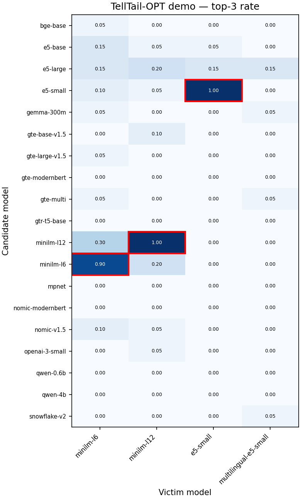

<p align="center">
  
</p>

<h1 align="center"><samp><b>&nbsp;T&nbsp;e&nbsp;l&nbsp;l&nbsp;T&nbsp;a&nbsp;i&nbsp;l&nbsp;</b></samp></h1>

<p align="center"><b>🪶 Fingerprinting retrievers in black-box systems</b></p>

TellTail identifies the embedding retriever behind a black-box RAG system by probing it
with crafted queries and reading which passages come back. Three query variants —
**OPT** (model-specific optimized triggers), **Topic**, and **Random** — across two threat
models (TM1 ordered, TM2 unordered top-k). The headline attack is **TellTail-OPT**, and the
quickest way to see it is the demo below. 🪶

## 🪶 Quick demo

Two runnable things, **no 8.8M-passage index required**. The demo ships a 5,000-passage
MS MARCO subset (`demo/data/`) and builds a small index per victim on the fly (cached after
the first run). Paper-scale reproduction is in [Full reproduction](#full-reproduction).

### 1. Fingerprint the victims &nbsp;·&nbsp; `python -m demo fingerprint` (CPU)

Probes four victim retrievers with the paper's ready optimized queries and names each one:

```
victim                  k=1         k=3         k=5         k=10
minilm-l6               minilm-l6   minilm-l6   minilm-l6   minilm-l6
minilm-l12              minilm-l12  minilm-l12  minilm-l12  minilm-l12
e5-small                e5-small    e5-small    e5-small    e5-small
multilingual-e5-small   UNK         UNK         UNK         UNK
```

Three victims are in the candidate set and are identified; `multilingual-e5-small` is an
**unseen** (non-candidate) multilingual sibling of `e5-small` and correctly returns **UNK** —
the fingerprint isn't fooled by a closely related model it has never registered. The command
also writes a top-3-rate heatmap (`S[candidate, victim]`, predicted cell outlined):

<p align="center"></p>

### 2. Optimize a NEW query &nbsp;·&nbsp; `python -m demo optimize` (GPU)

Craft a fresh trigger for `minilm-l6` and watch it fingerprint only that model:

```
victim                  NEW query rank   ready query rank
minilm-l6                            1                  1   <- attacked model
minilm-l12                         143                286
e5-small                          2528               2468
multilingual-e5-small             2740               3849
```

100 GASLITE steps with 50% semantic token-blocking: the new suffix drives the target to
**rank 1 on minilm-l6** and far down on the others. `--query-id N` picks a different query.

**Runtime.** `fingerprint`: the first run builds four small indices (~1–3 min on CPU — the
multilingual encoder dominates), cached afterwards → seconds. `optimize`: ~8 min on one GPU.
`optimize` needs the `tropt` optimizer library; `fingerprint` does not.

## Setup

Reference environment: **Python 3.12** (results produced with the pinned versions in
`requirements.txt` — torch 2.9.1 / CUDA 12.8, faiss-cpu, numpy 2.x).

```bash
python -m venv .venv && source .venv/bin/activate   # Python 3.12
pip install -r requirements.txt                     # pinned reference versions
pip install -e .                                    # the telltail package
cp .env.example .env                                # then fill in the paths (below)
```

The generic pipeline and `demo fingerprint` use only standard PyPI packages. Only the OPT
optimizer (`demo optimize` / `opt/optimize.py`) needs the private **`tropt`** library.

`.env` variables (all paths resolved only through these — no hardcoded paths):

| Variable | Meaning |
|---|---|
| `TELLTAIL_DATA_DIR` | corpus / query inputs |
| `TELLTAIL_INDEX_DIR` | precomputed FAISS indices (one per retriever) |
| `TELLTAIL_OUT_DIR` | pipeline + demo outputs |
| `OPENAI_API_KEY` | only for the `openai-3-small` model |
| `HF_TOKEN` | only for gated HF models |

## 🪶 TellTail-OPT

`opt/` crafts per-model **optimized trigger suffixes** (GASLITE / RASLITE+) so a carrier
query, once suffixed, retrieves a chosen target under the victim retriever — a stronger
fingerprint than the Topic/Random query variants.

```
opt/inputs/queries.csv  --optimize-->  phase1 (+ trigger)  --evaluate-->  ranks  --score-->  OSCR + ASR
```

- **`optimize.py`** — one optimizer, pluggable target (passage for TM1/TM2, centroid vector
  for TM3). Semantic token-blocking, prefixes from `configs/models.yaml`.
- **`evaluate.py`** — full-index rank of each target (`k=ntotal`, `nprobe=8192`).
- **`score.py`** — `--tm {1,2}` open-set scorer (OSCR + ASR-by-budget). Reproduces the paper
  goldens (`results/paper/tm{1,2}_telltail_opt_*.csv`) bit-exactly.

See `opt/README.md` for the full flow and the threat-model status.

## Full reproduction

The generic-query variants (**Topic**, **Random**) over the full MS MARCO index. One CLI,
five stages: `python -m generic_queries {retrieve,fetch,score,evaluate,sweep}`.

| Stage | Does | Needs |
|---|---|---|
| `retrieve` | per-model top-50 signatures over MS MARCO via each model's FAISS index | indices, GPU |
| `fetch` | union doc-ids → passage text (`global_cache.jsonl`) from BeIR/msmarco | network |
| `score` | per-target minicorpus score cache `scores[candidate,target]` (shape `[Q, Cv]`) | GPU |
| `evaluate` | ASR by query budget × top-k → `*_qb_k` summary (TM1 ordered / TM2 set) | score cache |
| `sweep` | open-set OSCR curves (CCR/FAR, AUOSCR) from the **same** score cache | score cache |

`--interface tm1|tm2` selects the threat model. *target* = deployed victim retriever;
*candidate* = a retriever in the attacker's set.

Three tiers, cheapest first (all paths from `.env`):

**Tier 0 — figures from the published CSVs (no GPU, seconds).**
```bash
python plots/asr_vs_budget.py --tm 1     # ASR vs budget, per strategy (OPT / Topic / Random)
python plots/plot_ccr_0_oscr.py --tm 2   # CCR@fa<=0 / CCR@fa<=2 / AUOSCR vs k
```

**Tier 1 — numbers from released score caches (CPU, minutes).**
```bash
python -m generic_queries evaluate --interface tm1 --queries data/queries/msmarco_topic.csv \
    --score-cache <cache> --top-ks 1,2,3,5,10,20,50 --n-repeats 100 --n-jobs 8
python -m generic_queries sweep    --interface tm2 --queries data/queries/msmarco_topic.csv \
    --score-cache <cache> --top-ks 1,2,3,4,5,10,20,50
```

**Tier 2 — full pipeline from scratch (FAISS indices + GPU).**
```bash
bash scripts/reproduce_generic.sh        # retrieve -> fetch -> score -> evaluate -> sweep
```

Exact paper configs: budgets `1,5,10,12,15,18,20`, seed `1337`, corpus `same_as_top_k`,
enumerate-when-≤-repeats on; TM1 `top_ks 1,2,3,5,10,20,50` `n_repeats 100`; TM2
`top_ks 1,2,3,4,5,10,20,50` `n_repeats 500`.

## Layout

- `demo/` — the reviewer demo (`fingerprint`, `optimize`) + shipped `data/` (5k corpus, ready queries).
- `opt/` — TellTail-OPT (optimize → evaluate → score), `tropt`-backed.
- `generic_queries/` — Topic/Random pipeline (retrieve/fetch/score/evaluate/sweep) + `_common.py`.
- `telltail/` — core library (model registry, env paths, embedding).
- `configs/models.yaml` — 53-model registry (19 candidates); byte-exact prefixes + `index_max_seq_length`.
- `indexing/` — FAISS index builder (`build_faiss.py`; `indexing/openai/` for the Batch pipeline).
- `data/queries/`, `plots/`, `scripts/`, `results/paper/` (published CSVs), `tools/`.

## Notes

- The **built** FAISS indices are not shipped (one IVF+SQ8 index over ~8.8M MS MARCO
  passages per model — multi-GB each). The code to build them is in `indexing/`; a rebuilt
  index matches the released one to within one SQ8 quantization step (GPU float jitter).
  The **demo** sidesteps this entirely with its small shipped corpus.
- Keys are read only from the environment / `.env` — never hardcoded.
