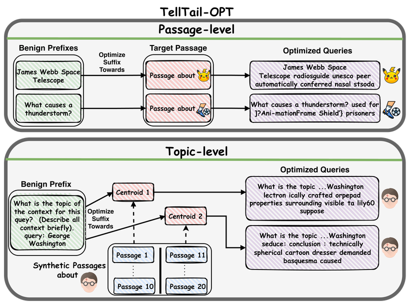

<p align="center">
  
</p>

<h1 align="center"><samp><b>&nbsp;T&nbsp;e&nbsp;l&nbsp;l&nbsp;T&nbsp;a&nbsp;i&nbsp;l&nbsp;</b></samp></h1>

<p align="center"><b>🪶 Fingerprinting retrievers in black-box systems</b></p>

TellTail identifies the embedding retriever behind a black-box RAG system by probing it
with crafted queries and reading what comes back. The headline attack is **TellTail-OPT**
(model-specific optimized triggers); the quickest way to see it is the demo below. 🪶

<p align="center">
  
</p>
<p align="center"><sub><b>TellTail-OPT.</b> Optimize a query suffix (with token-blocking) so the
suffixed query steers the victim retriever toward a chosen <b>target passage</b>
(<i>passage-level</i>, TM1/TM2) or a <b>topic centroid</b> built from synthetic passages
(<i>topic-level</i>, TM3) — the retrieved set then fingerprints the retriever.</sub></p>

| Threat model | What the attacker observes | Attack |
|---|---|---|
| **TM1** (ordered) | the ranked top-k passages | passage-level |
| **TM2** (unordered) | the top-k passage set | passage-level |
| **TM3** (response-only) | only the generated RAG answer | topic-level |

## 🪶 Quick demo

The repo ships a small corpus of **~5.6k MS MARCO
passages** (`demo/data/`) — used to run all the optimized queries against four victim
models — and builds a small index per victim on the fly (cached after the first run and outputs default to `outputs/demo/`).

From a fresh clone (Python 3.12):

```bash
python -m venv .venv && source .venv/bin/activate
pip install -r requirements.txt && pip install -e .
python -m demo fingerprint                 # CPU · no .env · no keys
```

The first run downloads the four victim models (public, no HF token) and builds their small
indices; later runs should be faster. `fingerprint` and `topic` need no API keys;
`optimize` additionally needs a GPU and the bundled `tropt`. Paper-scale reproduction is in
[Full reproduction](#full-reproduction).

### 1. Fingerprint the victims &nbsp;·&nbsp; `python -m demo fingerprint` (CPU)

Probes four victim retrievers with the paper's ready optimized queries (All candidate model's queries) and names each one:

```
victim                  k=1         k=3         k=5         k=10
minilm-l6               minilm-l6   minilm-l6   minilm-l6   minilm-l6
minilm-l12              minilm-l12  minilm-l12  minilm-l12  minilm-l12
e5-small                e5-small    e5-small    e5-small    e5-small
multilingual-e5-small   UNK         UNK         UNK         UNK
```

Three victims are in the candidate set and are identified; `multilingual-e5-small` is an
**unseen** (non-candidate) multilingual sibling of `e5-small` and correctly returns **UNK** —
the fingerprint isn't fooled by a closely related model it has never registered. The command
also writes a top-3-rate heatmap (`S[candidate, victim]`, predicted cell outlined) to `outputs/demo/`.

### 2. Topic-level / response-only attack &nbsp;·&nbsp; `python -m demo topic` (CPU)

The response-only analogue of `fingerprint`. Each candidate ships optimized **topic**
triggers (crafted toward a topic's centroid via `opt.optimize --mode topic`). The command
runs them against each of the demo's victims and checks whether the victim's **top-3 retrieved passages are
all on-topic** — the signal a response-only attacker reads off the generated answer — then
names each victim:

```
victim                  prediction
minilm-l6               minilm-l6
minilm-l12              minilm-l12
e5-small                e5-small
multilingual-e5-small   UNK
```

Pass **`--judge`** to
instead generate the RAG answer and score it with the LLM judge (the paper's criterion);
this makes API calls and needs `OPENAI_API_KEY` (generation) + `DEEPINFRA_API_KEY` (judge).
(Or judge it yourself 🕹️)

### 3. Optimize a NEW query &nbsp;·&nbsp; `python -m demo optimize` (GPU)

`fingerprint` and `topic` run on CPU, but **optimizing a trigger needs a CUDA GPU** 🍪. If
you'd like to craft your own suffix, run it on a GPU:

```bash
python -m demo optimize    # CUDA GPU required — torch 2.9.1 / CUDA 12.8, compute capability >= 7.0
```

It crafts a fresh trigger for `minilm-l6` and shows it fingerprinting only that model:

e.g., 

```
victim                  NEW query rank
minilm-l6                            1   <- attacked model
minilm-l12                         143
e5-small                          2528
multilingual-e5-small             2740
```

100 GASLITE steps with 50% semantic token-blocking: the new suffix **ranks the target
passage high on minilm-l6** and far down on the others. `--query-id N` picks a different
benign query to start from.


## Setup

The demo needs only the install above. The **full pipeline** additionally needs `.env`
(paths to the corpus / indices / outputs). Reference environment: **Python 3.12**, pinned
versions in `requirements.txt` (torch 2.9.1 / CUDA 12.8, faiss-cpu, numpy 2.x).

```bash
python -m venv .venv && source .venv/bin/activate   # Python 3.12
pip install -r requirements.txt && pip install -e .
cp .env.example .env                                # full pipeline only — fill in paths (below)
```

A single `pip install -r requirements.txt` sets up everything, including the OPT optimizer
**TROPT**. Use the provided copy — do **not** `pip install` TROPT from upstream (its current
API differs); see `third_party/tropt/`.

`.env` variables (all paths resolved only through these — no hardcoded paths):

| Variable | Meaning |
|---|---|
| `TELLTAIL_DATA_DIR` | corpus / query inputs |
| `TELLTAIL_INDEX_DIR` | precomputed FAISS indices (one per retriever) |
| `TELLTAIL_OUT_DIR` | pipeline + demo outputs |
| `OPENAI_API_KEY` | only for the `openai-3-small` model |
| `HF_TOKEN` | only for gated HF models |

## 🪶 TellTail-OPT

`opt/` crafts per-model **optimized trigger suffixes** so a benign query, once suffixed,
retrieves a chosen target under the victim retriever — a stronger fingerprint than the
Topic/Random query variants. See `opt/README.md` for the pipeline, CLI, and threat-model
status; how to run each reproduction is in [Full reproduction](#full-reproduction).

The optimizer is powered by **TROPT**, vendored under `third_party/` (see `third_party/tropt/`).

## Full reproduction

At paper scale, TellTail-OPT fingerprints the deployed retriever across the full 53-model
zoo — the diagonal (correct self-identification) dominates:

<p align="center"></p>
<p align="center"><sub>Top-3 rate <code>S[candidate, deployed model]</code> over the full MS MARCO index
(19 candidates × 53 deployed retrievers); outlined diagonal = correct identification.</sub></p>

All paths come from `.env`. Pick by how much you want to recompute.

### A. From scratch — build the indices, then run a variant (GPU)

```bash
python indexing/build_faiss.py --all        # one IVF+SQ8 index per model over ~8.8M MS MARCO passages
```

> `retrieve`, `score`, and `opt.optimize` default to the **whole 53-model registry**. Scope to
> one model with `--models <alias>` (`retrieve`/`opt.optimize`) or `--candidates`/`--targets
> <alias>` (`score`).

**Topic / Random** — one script runs the whole thing (both query sets, both threat models,
paper configs baked in):
```bash
bash scripts/reproduce_generic.sh                   # retrieve → fetch → score → evaluate → sweep
SKIP_UPSTREAM=1 bash scripts/reproduce_generic.sh   # reuse an existing score cache (skip retrieve/fetch/score)
```

Per query set (`msmarco_topic.csv`, `msmarco_random.csv`), that's the five stages
`retrieve → fetch → score → evaluate → sweep`:
```bash
python -m generic_queries retrieve --queries generic_queries/queries/msmarco_topic.csv --top-k 50
python -m generic_queries fetch    --queries generic_queries/queries/msmarco_topic.csv --max-k 50   # streams the full BeIR/msmarco corpus — needs live network
python -m generic_queries score    --queries generic_queries/queries/msmarco_topic.csv --corpus-top-k 50
python -m generic_queries evaluate --interface tm1 --queries generic_queries/queries/msmarco_topic.csv --top-ks 1,2,3,5,10,20,50
python -m generic_queries sweep    --interface tm1 --queries generic_queries/queries/msmarco_topic.csv --top-ks 1,2,3,5,10,20,50
# ...then again with --interface tm2 (TM2 uses top-ks 1,2,3,4,5,10,20,50, n_repeats 500)
```

**OPT, TM1/TM2** — one script runs `optimize → evaluate → score` for both threat models:
```bash
bash scripts/reproduce_opt.sh                   # optimize → evaluate → score (TM1 + TM2)
SKIP_OPTIMIZE=1 bash scripts/reproduce_opt.sh   # score straight from the shipped ranks (no GPU, no indices)
```

Under the hood, the three stages:
```bash
python -m opt.optimize --queries opt/inputs/queries.csv --out outputs/phase1
python -m opt.evaluate --attacks outputs/phase1/phase1_attacks.csv --out outputs/opt_long.csv --eval-models <aliases>
python -m opt.score    --tm 1 --long outputs/opt_long.csv --out outputs/opt_tm1    # and --tm 2
```

**OPT, TM3 (response-only)** — opt in with `RUN_TM3=1`:
```bash
RUN_TM3=1 bash scripts/reproduce_opt.sh         # optimize --mode topic → retrieve → llm → judge → heatmap
```

Needs the **full** passage store from `tools/build_passage_store.py` (no `--sample`: a sampled
store won't contain the retrieved docids, so `retrieve` returns empty passage text and `llm`
produces meaningless output — with no error), plus OpenAI (RAG) + DeepInfra (judge) keys. See
`opt/README.md`. (The bare `python plots/judge_heatmap.py` in Section C plots the **shipped**
verdicts in `results/opt/tm3_judgments/`, not your run's — the script points it at your fresh
verdicts.)

### B. From the shipped OPT ranks (+ your own generic score cache) (CPU, minutes — no indices)

OPT TM1/TM2 scores come straight from the shipped ranks. For the generic (Topic/Random)
chain **no score cache is shipped** — `<cache>` is the `scores/` dir that Section A's `score`
writes (`$TELLTAIL_OUT_DIR/generic/<query_set>/scores`), which is also the default if you omit
the flag.

```bash
python -m opt.score --tm 1 --long results/opt/tm1_tm2_ranks/ranks.csv --out outputs/opt_tm1   # and --tm 2
python -m generic_queries evaluate --interface tm1 --queries generic_queries/queries/msmarco_topic.csv \
    --score-cache <cache> --top-ks 1,2,3,5,10,20,50 --n-repeats 100 --n-jobs 8
python -m generic_queries sweep    --interface tm2 --queries generic_queries/queries/msmarco_topic.csv \
    --score-cache <cache> --top-ks 1,2,3,4,5,10,20,50
```

### C. Figures only (from the published CSVs, no GPU, seconds)

```bash
python plots/asr_vs_budget.py   --tm 1     # ASR vs budget (OPT / Topic / Random)
python plots/plot_ccr_0_oscr.py --tm 2     # CCR@fa<=0 / CCR@fa<=2 / AUOSCR vs k
python plots/judge_heatmap.py              # TM3 response-only heatmap (from the shipped verdicts)
```

Exact paper configs: budgets `1,5,10,12,15,18,20`, seed `1337`, corpus `same_as_top_k`,
enumerate-when-≤-repeats on; TM1 `top_ks 1,2,3,5,10,20,50` `n_repeats 100`; TM2
`top_ks 1,2,3,4,5,10,20,50` `n_repeats 500`.

## Layout

- `demo/` — the reviewer demo (`fingerprint`, `topic`, `optimize`) + shipped `data/` (~5.6k corpus, ready queries).
- `opt/` — TellTail-OPT (optimize → evaluate → score), `tropt`-backed.
- `generic_queries/` — Topic/Random pipeline (retrieve/fetch/score/evaluate/sweep) + `_common.py`; ships the query sets in `generic_queries/queries/`.
- `telltail/` — core library (model registry, env paths, embedding).
- `configs/models.yaml` — 53-model registry (19 candidates); byte-exact prefixes + `index_max_seq_length`.
- `indexing/` — FAISS index builder (`build_faiss.py`; `indexing/openai/` for the Batch pipeline).
- `plots/`, `scripts/`, `results/paper/` (published CSVs), `tools/`.

## Notes

- The **built** FAISS indices are not shipped (one IVF+SQ8 index over ~8.8M MS MARCO
  passages per model — multi-GB each). The code to build them is in `indexing/`; a rebuilt
  index matches the released one to within one SQ8 quantization step (GPU float jitter).
  The **demo** sidesteps this entirely with its small shipped corpus.
- Keys are read only from the environment / `.env` — never hardcoded.
